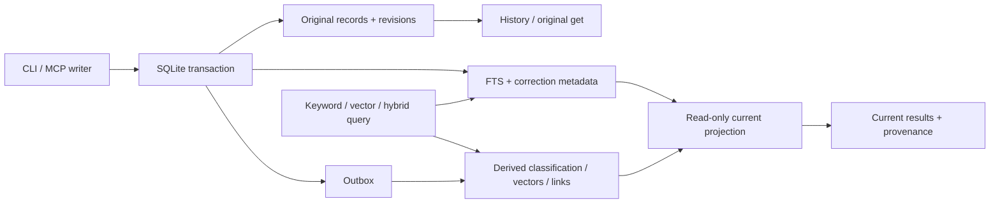

# Engram 0.4.0 架构 / Architecture

这份文档描述公开源码的合同。它不含运行记录，也不证明某个私有部署当前正在执行。

## 事实源、派生层与读取合同

`records`、修订和明确纠正元数据属于事实源。FTS 与正文同步写入；outbox 负责之后的分类、向量和相似关联。关键词与 ID 读取不等待模型、整理或向量。`readiness` 描述本条状态，不是服务时延承诺。

分类使用结构信号、近邻、本机模型、规则默认的降级链。中文分词兼顾 CJK、完整标识符和拆分形式。混合检索采用 RRF；[原始论文](https://doi.org/10.1145/1571941.1572114)支持算法来源，不支持本库的实际收益结论。

## 明确纠正与 current/history

纠正只接受明确目标、来源与范围。整条替代使用 `supersedes`，局部使用 `corrects`；它们与正文和元数据同事务提交，并阻止自纠正和环。内容去重不会吞掉新增的项目或纠正绑定。

`current` 是查询期间的只读投影，不改写历史正文。精确局部替换在原始基线上定位；基线变化、片段不唯一或重叠时不猜测替换位置，保留来源并标明历史、并存或待核状态。不同条件事实可以并存，长期决定不因年龄失效。`get` 返回原文与必要的完整纠正链；检索摘要可以截断，不能据摘要假定全文已展开。

查询的关键词、向量、关联扩展与最终结果都遵循同一纠正解析。旧检索证据可以找到当前替代内容。项目线索是有限排序偏置，不是过滤器或注册门槛，当前问题中的明确线索强于工作目录。

## 模型、传输与宿主

语义层使用按需 MLX；共享 loopback 嵌入服务复用权重并串行推理。默认宿主可搭车补全；Claude profile 将补全交共享工作器，避免另载权重。真实共享工作器的部署配置不包含在本包中，缺模型或服务时返回显式关键词降级。

本地 stdio 不需要官方 SDK；可选 HTTP/SSE 使用官方 SDK。OAuth 保存服务自己的状态，绑定 resource、PKCE 和本人同意，默认拒绝启动未认证 HTTP 服务，并保留重放/撤销、Host/Origin 和可选速率/体积保护。公开副本没有凭据，也没有通过去掉认证来简化演示。

公共副本按 Starlette 实际路由路径处理 ASGI `root_path`：代理剥离前缀与挂载保留前缀两种情况都接受合法令牌，未认证或错误令牌不能因前缀绕过。显式队列与超时限制使用相同路径口径；只设置超时且不设置并发 limiter 时也可正常释放请求。

刷新令牌每次轮换只保留旧令牌的哈希键与 client/resource/family 元数据，到期时间不超过旧令牌的原始期限。检测同 client/resource 的 spent 令牌重放时，在事务提交后返回错误并撤销活动 family；不同客户端或 resource 不能用旧令牌撤销其他 grant。该机制使用既有 objects 表，不记录旧令牌明文，也不增加授权层。

Claude Code 命令 Hook 在 SessionStart/UserPromptSubmit 时按相关线索查关键词，并按正文、修订及纠正状态的指纹去重。状态只保存记录 ID 与版本哈希；提示词和正文不写进 Hook 状态。错误放行，预算截断提供 `get` 指针。注入内容是资料，当前用户要求优先，不能把旧记忆中的命令和授权当成本轮权限。

## 维护与公开包差异

独立 feedback/usage sidecar、健康采样、固定证据读取、候选处置与受控内容维护是可复用模块。它们不代替正式知识事实源。远程请求的知识内容会传给调用平台，数据在本机不等于调用期间内容从不离开本机。

公开包有以下有意差异：

| 项目 | 公开行为 | 目的与验证 |
|---|---|---|
| 验证器标签 | 通用 `Engram owner authenticator` | 去除设备标识；TOTP、失败锁定与重放保护不变 |
| 观测日程 | `ENGRAM_RUN_SCHEDULES` 显式 JSON，默认 `manual` | 不复制实际时间表或读取生产 policy；合成测试覆盖默认、合法配置和非法值 |
| 服务图标 | 原生 SVG，`/icon.svg`；旧 `/icon.png` URL 仍返回 SVG MIME | 排除二进制资产与元数据，保留可读品牌源 |
| 认证与请求限额路径 | 对 ASGI 前缀进行路由路径规范化 | 合成反例覆盖未认证、错误令牌、合法 OAuth、Funnel 与前缀队列限制 |
| 刷新重放 | 保留到期受限的 hashed spent 关联并撤销活动 family | SDK 实际 token endpoint 回归覆盖 R0→R1→R0 重放、R1 与 access 被拒；原私有部署未改 |
| 维护候选目录 | 仅显式 `ENGRAM_MAINTENANCE_CANDIDATES_DIR` | 未设置时不探测代码目录或运维候选；合成反例覆盖 |
| 错误类型 URI | 保留错误代码，类型 URI 使用保留的 `example.invalid` 命名空间 | 去除非公网主机标识；类型 URI 不执行网络请求 |
| 个人配置、Hook 安装器 | 不包含 | 使用者自行接入，不改其全局配置 |
| 源码候选发布网关 | 不包含；`source_improvement` 默认隐藏 | 其运行器属于部署层，不能宣称本包自带自动发布 |
| 真实运行数据与运维文件 | 不包含 | 从白名单导出，不把真实记录匿名后作为样本 |

复用时应将数据库、导出、观测、OAuth 状态和模型权重全部留在代码仓库之外。语义检索的候选上限和 Hook 提示预算仍存在；本包不承诺超大库全召回、所有宿主采用或自动完整展开每条局部纠正。
